# SmartPatrol 使用者手冊


<!-- pagebreak -->

## 1. 簡介 

SmartPatrol 是一套巡檢與設備監控工具，整合 CFX/RabbitMQ、Modbus TCP 的 WISE-S100 指示燈監控，以及 Cupola360 攝影機事件視角切換，並提供設備與使用者管理、API 觸發等功能。

## 2. 系統需求 

- 作業系統：Windows 10/11
- .NET 執行環境：.NET 8（專案已設定）
- 網路需求：可連線 RabbitMQ／Modbus TCP 裝置／Cupola360 服務（依功能而定）

## 3. 安裝與啟動 

- 下載執行檔後啟動 `SmartPatrol`
- 第一次啟動先到 `CFX Configuration` 設定連線與佇列，再回 `Dashboard` 確認狀態

<!-- pagebreak -->

## 4. 介面導覽 


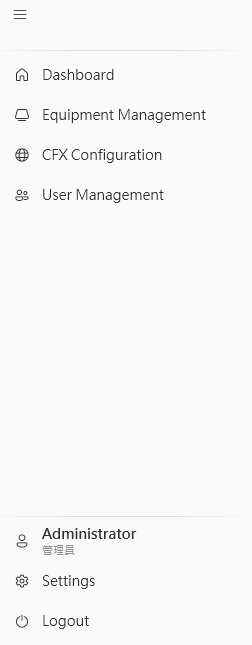


- Dashboard
  - 圖示：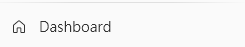
  - 功能說明：系統總覽、即時狀態與訊息列表
- Equipment Management
  - 圖示：
  - 功能說明：設備清單、ROI 視窗、Cupola360 視角與故障/API 設定
- CFX Configuration
  - 圖示：
  - 功能說明：CFX/RabbitMQ 連線、佇列與記錄設定
- User Management
  - 圖示：
  - 功能說明：使用者與權限管理（可能預設隱藏）
- Footer
  - 圖示：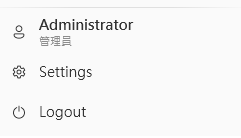
  - 功能說明：`Settings`、`Login`、`Logout`、使用者資訊


> **說明** <br> 
> `使用者` 可透過視窗左側的 `導覽列` 進行登入登出、前往各功能頁面等操作。 <br>

```
  特定功能需要特定權限才能存取，未登入或權限不足時會受限。
```
---

<a id="discription1"></a>
#### 4.1 Dashboard（儀表板）


> **說明** <br>
> 
> Dashboard (儀表板) 適用於顯示
即時顯示系統總覽與各項服務狀態，包含設備數量、警告/錯誤統計，以及 CFX、Cupola360、WISE-S100 監控資訊。並提供系統訊息列表，方便快速掌握異常來源、時間與內容以利排除問題。
---
##### 系統概覽(System Overview)

- 設備總數
  - 圖示：
  - 說明：系統中註冊的設備總數量
- 啟用數量
  - 圖示：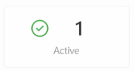
  - 說明：目前啟用狀態的設備數量
- 警告
  - 圖示：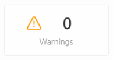
  - 說明：系統警告狀態數量
- 錯誤
  - 圖示：
  - 說明：系統錯誤狀態數量


>  **說明** <br>
> 此區塊用於快速掌握整體系統健康狀態，當警告或錯誤數量異常時，應優先進行確認。
---
##### 系統狀態(System Status)
**CFX Service**

   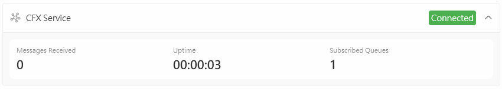

- 連線狀態
  - 圖示：
  - 說明：CFX服務的連線狀態
- 訊息數
  - 圖示：
  - 說明：已處理的訊息總數
- Uptime
  - 圖示：
  - 說明：服務運行時間
- 訂閱佇列數
  - 圖示：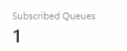
  - 說明：目前訂閱的佇列數量


> **說明** <br>
> CFX Service 區塊用於監看 SmartPatrol 與 CFX/RabbitMQ 的連線健康狀態與訊息
---
**Cupola360**
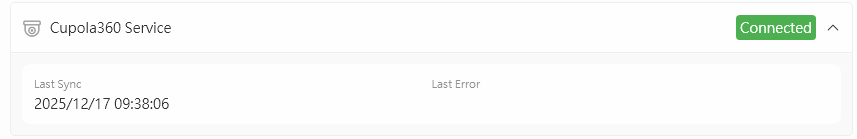

- Last Sync
  - 圖示：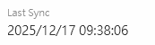
  - 說明：最後同步時間
- Last Error
  - 圖示：
  - 說明：最後錯誤狀態


  > **說明** <br>
  > Cupola360 區塊用於監看 SmartPatrol 與 Cupola360 巡檢系統的同步與連線健康狀態：

---
**WISE-S100 監控**

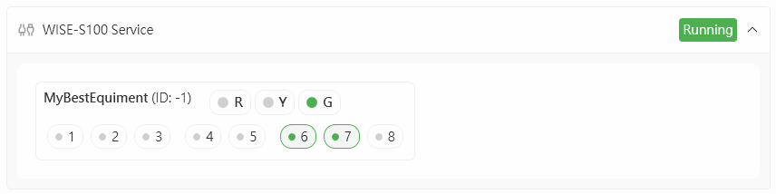

- 設備名稱
  - 圖示：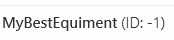
  - 說明：顯示設備的名稱標識
- 當前燈號
  - 圖示：
  - 說明：設備目前的燈號狀態指示
- WISE-S100 通道狀態
  - 圖示：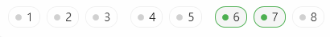
  - 說明：各通道的詳細狀態顯示


> **說明** <br>
> WISE-S100 監控區塊用於顯示各設備三色燈（R/Y/G）與各通道（Channel）的即時狀態，資料來源為設備管理中 `Fault → WISE-S100（Modbus TCP）` 的連線參數與通道對應設定。


---
##### 系統訊息


> **說明** <br>
> 系統訊息區塊用於顯示系統運作時的各項訊息，如CFX消息、連線狀態改變等等。

##### 參考操作
  - [啟動與驗證 CFX 連線](#operation1)

---

<a id="discription2"></a>
#### 4.2 Equipment Management（設備管理）


##### 工具列


- 搜尋設備列表
  - 圖示：
  - 功能說明：快速搜尋並篩選設備列表中的項目
- 新增設備
  - 圖示：
  - 功能說明：建立新的設備項目
- 刪除選取設備
  - 圖示：
  - 功能說明：移除目前選取的設備
- 儲存變更
  - 圖示：
  - 功能說明：保存對設備設定的所有修改
- 更多選項
  - 圖示：
  - 功能說明：展開額外功能選單


其中， 有以下功能

- Import
  - 圖示：
  - 功能說明：匯入設備設定檔案
- Export
  - 圖示：
  - 功能說明：匯出當前設備設定為檔案
- Export to Event Api
  - 圖示：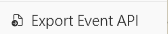
  - 功能說明：匯出設備資料至事件 API
- Push to Cupola360
  - 圖示：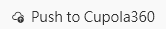
  - 功能說明：推送設備設定到 Cupola360 系統


##### 設備列表

顯示當前設定的設備列表


- 拖曳
  - 圖示：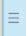
  - 說明：可拖曳調整設備在列表中的順序
- 啟用開關
  - 圖示：
  - 說明：切換設備的啟用/停用狀態
- 設備名稱
  - 圖示：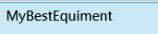
  - 說明：顯示設備的識別名稱


##### 詳情（選取設備後顯示）


| 分頁名稱 | 功能說明 |
|----------|----------|
| Basic 分頁 | 設備的基礎訊息 |
| Cupola360 分頁 | Cupola360巡檢相關的設定 |
| Fault 分頁 | 設備異常的設定 |

---

###### Basic 分頁 

> 設備的基本資訊

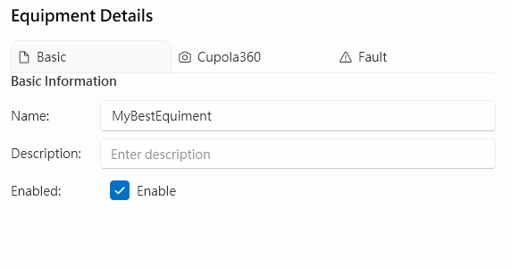


| 項目 | 說明 |
|------|------|
| Name | 設備名稱 |
| Description | 設備描述 |
| Enabled | 啟用狀態 |

---
<a id="discription2.2"></a>
###### Cupola360 分頁

<a id="discription2.2.1"></a>
**ROI Window**

> 設定設備顯示在Cupola360的ROI基本資訊的頁面


| 項目 | 說明 |
|------|------|
| Display Name | 顯示名稱 |
| Icon Type | 圖示類型 |
| RTSP URL | 要顯示的畫面的 URL |
| Position X/Y | 位置 X/Y（0~1） |
| Opacity | 透明度 |

<a id="discription2.2.2"></a>
**Hyperlinks**

> 新增/移除連結；列表含 `Name`、`URL`
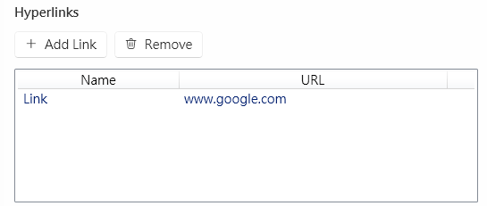


- 新增超連結
  - 圖示：
  - 說明：新增連結項目到列表中
- 刪除超連結
  - 圖示：
  - 說明：移除選取的連結項目
- 超連結列表
  - 圖示：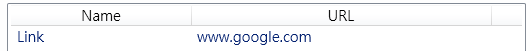
  - 說明：顯示目前設定的連結清單


<a id="discription2.2.3"></a>
**Sub ROIs**

> 新增、刪除、修改 Sub ROI 的設定

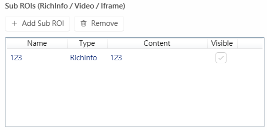


- 新增Sub ROI
  - 圖示：
  - 說明：新增子區域項目到列表中
- 刪除Sub ROI
  - 圖示：
  - 說明：移除選取的子區域項目
- Sub ROI列表
  - 圖示：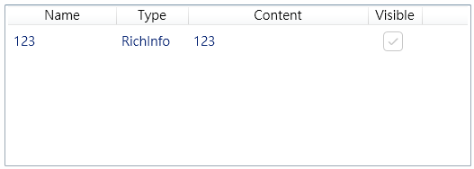
  - 說明：顯示目前設定的子區域清單，包含名稱、類型、內容及可視狀態


**Alarm 視角設定**

> 設定異常發生時 Cupola360 巡檢系統的畫面要轉向的座標、大小、時間等參數


- Center X/Y
  - 圖示：-
  - 說明：視角中心座標（範圍 0~1）
- Size
  - 圖示：-
  - 說明：視角縮放大小（建議 0.05~0.15）
- Display Time (ms)
  - 圖示：-
  - 說明：顯示時間，單位毫秒（-1=永久顯示）
- 測試動態事件
  - 圖示：
  - 說明：送出 Dynamic Event 進行測試
- 結束事件測試
  - 圖示：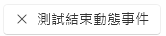
  - 說明：送出 1ms 結束事件


---
<a id="discription2.3"></a>
###### Fault 分頁

<a id="discription2.3.1"></a>
**CFX**

> 異常來源是CFX時的相關設定


- 應用 CFX
  - 圖示：
  - 說明：啟用或停用 CFX 功能
- 設定 CFX Handle
  - 圖示：-
  - 說明：設定 CFX 系統中的唯一識別控制代碼名稱


<a id="discription2.3.2"></a>
**WISE-S100（Modbus TCP）**

> 異常來源是 WISE-S100的相關設定

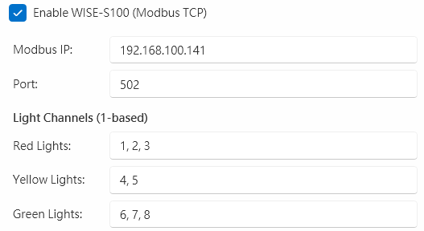


- 啟用 WISE-S100
  - 圖示：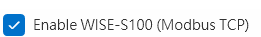
  - 說明：啟用或停用 WISE-S100 功能
- Modbus IP
  - 圖示：-
  - 說明：設定 WISE-S100 設備的 IP 位址
- Port
  - 圖示：-
  - 說明：設定 Modbus TCP 通訊埠（預設 502）
- 紅燈通道
  - 圖示：-
  - 說明：紅燈對應的通道號碼（如 7,8）
- 黃燈通道
  - 圖示：-
  - 說明：黃燈對應的通道號碼（如 4,5,6）
- 綠燈通道
  - 圖示：-
  - 說明：綠燈對應的通道號碼（如 7,8）


**API 設定（故障觸發）**

> 設定當異常觸發時要做動的API請求


- 新增API請求
  - 圖示：
  - 說明：新增API動作項目到列表中
- 刪除API請求
  - 圖示：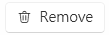
  - 說明：移除選取的API動作項目
- API列表
  - 圖示：
  - 說明：顯示目前設定的API清單，包含名稱、方法、網址及啟用狀態


##### 參考操作  
  - [設備新增與基本設定](#operation2)
  - [設定 ROI 與 Cupola360 警報視角](#operation3)
  - [新增 Hyperlink](#operation4)
  - [新增 Sub ROI](#operation5)
  - [儲存與推送設定](#operation6)
  - [設定 WISE-S100 指示燈通道](#operation7)
  - [故障觸發 API 設定與測試](#operation8)
  - [匯入／匯出設定](#operation9)

<a id="discription3"></a>
#### 4.3 CFX 設定頁面 


##### 工具列

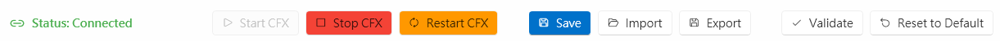


- 啟動CFX服務
  - 圖示：
  - 說明：啟動 CFX 連線服務
- 停止CFX服務
  - 圖示：
  - 說明：停止 CFX 連線服務
- 重啟CFX服務
  - 圖示：
  - 說明：重新啟動 CFX 連線服務
- 儲存設定
  - 圖示：
  - 說明：保存當前的 CFX 設定變更
- 匯入設定
  - 圖示：
  - 說明：從檔案匯入 CFX 設定
- 匯出設定
  - 圖示：
  - 說明：將當前設定匯出為檔案
- 檢查設定
  - 圖示：
  - 說明：驗證 CFX 設定的正確性
- 回覆為預設值
  - 圖示：
  - 說明：重置所有設定為系統預設值


##### 設定與 CFX 連線參數說明：
- Enable CFX
  - 圖示：
  - 說明：啟用或停用 CFX 連線功能的開關，設定為 true 時開啟 CFX 通訊
- Endpoint URL
  - 圖示：-
  - 說明：CFX 伺服器的連線端點網址，格式通常為 `amqp://hostname:port`
- CFX Handle
  - 圖示：-
  - 說明：CFX 系統中唯一識別此連線的控制代碼名稱
- Username
  - 圖示：-
  - 說明：連線至 CFX 伺服器所需的使用者帳號
- Password
  - 圖示：-
  - 說明：對應使用者帳號的密碼認證
- Auto Reconnect
  - 圖示：-
  - 說明：當連線中斷時是否自動重新連線的設定選項
- Reconnect Interval
  - 圖示：
  - 說明：自動重連的時間間隔，單位通常為秒


##### 設定RabbitMQ的QUEUE
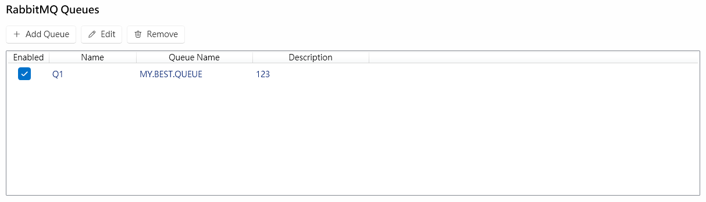


- 新增QUEUE
  - 圖示：
  - 說明：新增RabbitMQ佇列項目到列表中
- 修改QUEUE
  - 圖示：
  - 說明：編輯選取的佇列設定
- 刪除QUEUE
  - 圖示：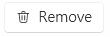
  - 說明：移除選取的佇列項目
- 當前佇列列表
  - 圖示：
  - 說明：顯示目前設定的RabbitMQ佇列清單，包含啟用狀態、名稱、佇列名稱及描述


##### 參考操作
  - [啟動與驗證 CFX 連線](#operation1)
  - [匯入／匯出設定](#operation9)

#### 4.4 使用者管理頁面 

> 使用者管理頁面提供完整的使用者帳戶管理功能，包含新增、編輯、刪除使用者以及權限控制。


##### 工具列功能
- 新增使用者
  - 圖示：
  - 說明：新增使用者帳戶
- 編輯使用者
  - 圖示：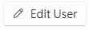
  - 說明：編輯選取的使用者資訊
- 重設密碼
  - 圖示：
  - 說明：重設使用者密碼
- 刪除使用者
  - 圖示：
  - 說明：刪除選取的使用者
- 重新整理
  - 圖示：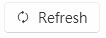
  - 說明：重新整理使用者列表


##### 參考操作
  - [使用者管理](#operation10) </br>

<!-- pagebreak -->

## 5. 常用操作 

>  **注意**：取得權限前僅限觀看 Dashboard，請點擊左下角 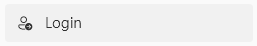 登入後操作 

<a id="operation1"></a>
### 5.1 啟動與驗證 CFX 連線 [↩](#discription3)

- 1
  - 操作：
  - 說明：左方導覽列點擊後進入 CFX 設定頁面
- 2
  - 操作：設定連線參數
  - 說明：填入 `Endpoint URL`（如 `amqp://<your-host-address>:<port>`）、`Username`、`Password`、`CFX Handle`
- 3
  - 操作：啟用設定選項
  - 說明：勾選 `Enable CFX Integration`，設定 `Auto Reconnect` 與 `Reconnect Interval`（可保持預設）
- 4
  - 操作：驗證並啟動服務
  - 說明：按下驗證設定按鈕，成功後啟動服務
- 4.1
  - 操作：
  - 說明：驗證設定
- 4.2
  - 操作：
  - 說明：若未運行則啟動服務
- 4.3
  - 操作：
  - 說明：若正在運行中則重新啟動
- 5
  - 操作：確認連線狀態
  - 說明：回到 `Dashboard`，確認以下狀態
- 5.1
  - 操作：
  - 說明：CFX 連線徽章顯示已連線
- 5.2
  - 操作：
  - 說明：訊息數持續累計


<a id="operation2"></a>
### 5.2 設備新增與基本設定 [↩](#discription2)

- 1
  - 操作：進入設備管理
  - 說明：進入設備管理頁面並新增設備
- 1.1
  - 操作：
  - 說明：左方導覽列點擊設備管理
- 1.2
  - 操作：
  - 說明：點擊新增設備按鈕
- 2
  - 操作：填入設備資訊
  - 說明：填入 `Name`、`Description`，勾選 `Enabled`
- 2.1
  - 操作：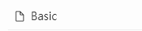
  - 說明：在 Basic 分頁中填入
- 3
  - 操作：
  - 說明：點擊`Save`按鈕儲存變更
- 4
  - 操作：確認設備已新增
  - 說明：在清單中確認新設備已出現且可啟用/停用


<a id="operation3"></a>
### 5.3 設定 ROI 與 Cupola360 警報視角 [↩](#discription2.2)

- 1
  - 操作：切換到 Cupola360 分頁
  - 說明：進入 Cupola360 相關設定頁面
- 1.1
  - 操作：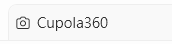
  - 說明：於設備詳情切換分頁
- 2
  - 操作：**ROI Window** 設定
  - 說明：設定設備在 Cupola360 中的顯示資訊
- 2.1
  - 操作：Display Name
  - 說明：設定要顯示的名稱
- 2.2
  - 操作：Icon Type
  - 說明：選擇 `ROI` 顯示的圖像
- 2.3
  - 操作：RTSP URL
  - 說明：設定要顯示的畫面 URL
- 2.4
  - 操作：Position X/Y
  - 說明：設定 `ROI` 在畫面中的位置（範圍為 0 ~ 1）
- 2.5
  - 操作：Opacity
  - 說明：設定 `ROI` 的透明度
- 3
  - 操作：**測試警報視角**
  - 說明：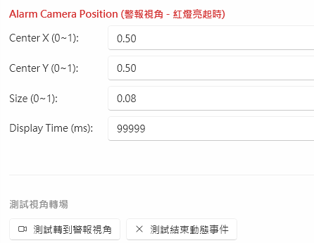
- 3.1
  - 操作：測試視角切換
  - 說明：按 `測試轉到警報視角`，確認視角切換效果
- 3.2
  - 操作：結束測試
  - 說明：完成後按 `測試結束動態事件`


<a id="tip1"></a>

#### 如何獲取攝影機的RTSP

- 1. 前往 Cupola360
  - 說明：
- 2. 點擊 Manager system
  - 說明：
- 3. 選取想查詢的相機 → 編輯 → 內部網址
  - 說明：


<a id="operation4"></a>
### 5.4 新增 Hyperlink [↩](#discription2.2.2)

- 1
  - 操作：點擊 
  - 說明：新增超連結項目
- 2
  - 操作：在彈出視窗中填入資料
  - 說明：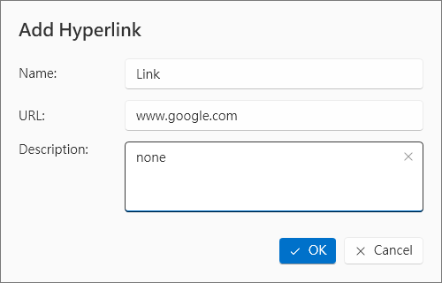
- 2.1
  - 操作：Name
  - 說明：要顯示在 ROI 上的名稱
- 2.2
  - 操作：URL
  - 說明：連結網址
- 2.3
  - 操作：Description
  - 說明：說明
- 3
  - 操作：**結果確認**
  - 說明：檢查新增結果
- 3.1
  - 操作：檢查列表
  - 說明：在列表中顯示剛才新增的 URL
- 3.2
  - 操作：檢查巡檢畫面
  - 說明：


<a id="operation5"></a>
### 5.5 新增 Sub ROI [↩](#discription2.2.3)

- 1
  - 操作：點擊 
  - 說明：新增 Sub ROI 項目
- 2
  - 操作：在彈出視窗中填入資料
  - 說明：[Sub ROI 新建視窗的說明](#tip5.5.1)
- 3
  - 操作：**結果確認**
  - 說明：檢查新增結果
- 3.1
  - 操作：檢查列表
  - 說明：在列表中顯示剛才新增的 Sub ROI
- 3.2
  - 操作：檢查巡檢畫面
  - 說明：


<a id="tip5.5.1"></a>
#### Sub ROI 新建視窗的說明
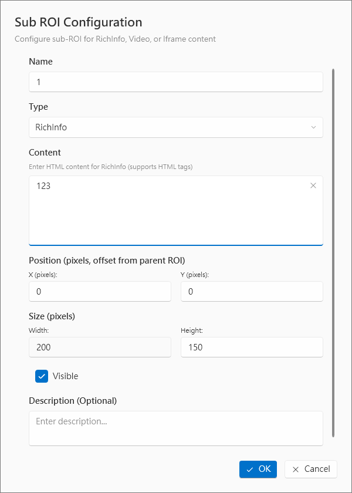


- Name
  - 說明：子視窗的名稱
  - 範例/補充：顯示在 Sub ROI 上的識別名稱
- Type
  - 說明：Sub ROI 的類型
  - 範例/補充：選擇不同類型會影響 Content 的設定選項
- **Content**（依照 Type 有不同選項）
- └ RichInfo
  - 說明：
  - 範例/補充：輸入想要顯示的文字
- └ Video
  - 說明：
  - 範例/補充：將影片加到 Cupola360 後，可在此處選擇要加上的影片
- └ Iframe
  - 說明：
  - 範例/補充：輸入要嵌入的網址
- └ Image
  - 說明：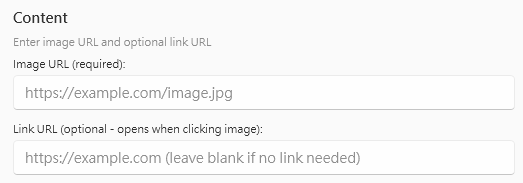
  - 範例/補充：圖片設定
- Position X/Y
  - 說明：跟母 ROI 的位移
  - 範例/補充：設定 Sub ROI 相對於主 ROI 的位置偏移
- Size
  - 說明：Sub ROI 的大小
  - 範例/補充：設定 Sub ROI 的長寬尺寸
- Visible
  - 說明：可視/不可視
  - 範例/補充：控制 Sub ROI 是否在巡檢畫面中顯示
- Description
  - 說明：描述
  - 範例/補充：Sub ROI 的詳細說明或備註


<a id="operation6"></a>
### 5.6 儲存與推送設定 [↩](#discription2)

- 1
  - 操作：
  - 說明：點擊 `Save` 儲存設備設定變更
- 2
  - 操作：推送設定到 Cupola360
  - 說明：推送設定到巡檢畫面
- 2.1
  - 操作：
  - 說明：點擊更多選項
- 2.2
  - 操作：
  - 說明：選擇推送到 Cupola360


<a id="operation7"></a>
### 5.7 設定 WISE-S100 指示燈通道 [↩](#discription2.3.2)

- 1
  - 操作：進入故障設定分頁
  - 說明：切換到故障設定分頁
- 1.1
  - 操作：
  - 說明：進入設備管理
- 1.2
  - 操作：
  - 說明：切換到 Fault 分頁
- 2
  - 操作：填入連線參數與通道設定
  - 說明：[取得並填入通道設定](#tip5.5.1)
- 3
  - 操作：儲存並驗證
  - 說明：點擊 `Save` 後回 `Dashboard` 檢查 WISE-S100 狀態與各設備的通道 Chips 顯示


<a id="tip5.5.1"></a>
#### 取得並填入通道設定

> 透過工具取得Wise-S100通道與燈號的對應關係後填入設定

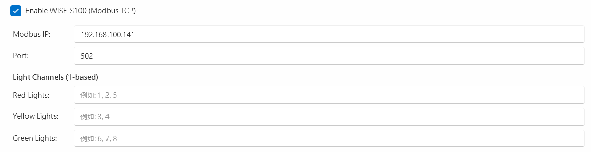

- 1
  - 操作說明：確認將 WISE-S100 正確的安裝到三色燈上
  - 圖示：
- 2
  - 操作說明：燈號變化時使用 `open modscan` 等工具讀取 40017 ~ 40024
  - 圖示：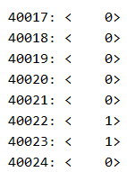
- 3
  - 操作說明：將結果以逗號為分隔填入對應欄位 (例如：1,2,3)
  - 圖示：


<a id="operation8"></a>
### 5.8 故障觸發 API 設定與測試 [↩](#discription2.3)

- 1
  - 操作：進入 API 設定區塊
  - 說明：進入設備管理的故障分頁中的 API 設定區塊
- 1.1
  - 操作：
  - 說明：進入設備管理
- 1.2
  - 操作：
  - 說明：切換到 Fault 分頁
- 1.3
  - 操作：`API 設定` 區塊
  - 說明：按 `Add` 新增動作
- 2
  - 操作：填入 API 參數
  - 說明：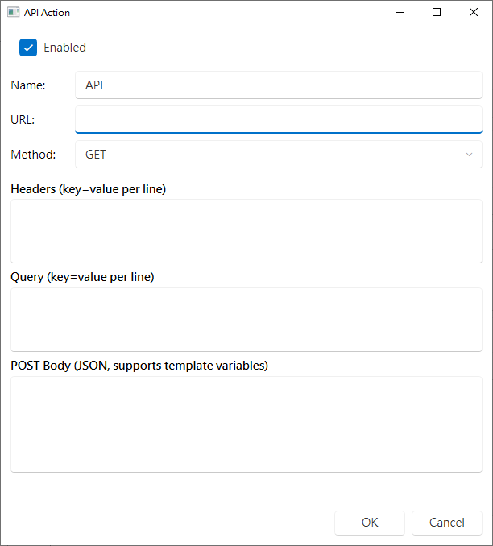
- 3
  - 操作：啟用並測試
  - 說明：切換 `Enabled` 開啟該動作，使用列表中的 `Send` 測試一次呼叫，確認回應與行為
- 4
  - 操作：儲存設定
  - 說明：點擊 `Save` 儲存 API 觸發設定


<a id="operation9"></a>
### 5.9 匯入／匯出設定

#### 設備管理匯出設定 [↩](#discription2)

- 1
  - 操作：
  - 說明：進入設備管理頁面
- 2
  - 操作：
  - 說明：點擊更多選項按鈕
- 3
  - 操作：
  - 說明：匯出目前設備設定為檔案


#### 設備管理匯入設定 [↩](#discription2)

- 1
  - 操作：
  - 說明：進入設備管理頁面
- 2
  - 操作：
  - 說明：點擊更多選項按鈕
- 3
  - 操作：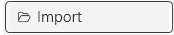
  - 說明：匯入設備設定檔案


#### CFX 設定匯出 [↩](#discription3)

- 1
  - 操作：
  - 說明：進入 CFX 設定頁面
- 2
  - 操作：
  - 說明：匯出目前 CFX 設定為檔案


#### CFX 設定匯入 [↩](#discription3)

- 1
  - 操作：
  - 說明：進入 CFX 設定頁面
- 2
  - 操作：
  - 說明：匯入 CFX 設定檔案


<a id="operation10"></a>
### 5.10 使用者管理 [↩](#discription4)
#### 新增使用者

- 1
  - 操作：
  - 說明：進入使用者管理頁面
- 2
  - 操作：
  - 說明：點擊新增使用者按鈕
- 3
  - 操作：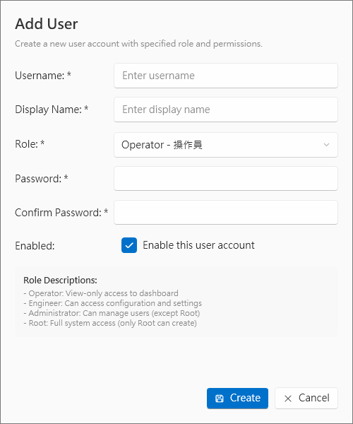
  - 說明：填入使用者名稱、設定登入密碼、選擇使用者權限等級
- 4
  - 操作：
  - 說明：完成創建動作


#### 修改使用者資料

- 1
  - 操作：
  - 說明：進入使用者管理頁面
- 2
  - 操作：選取要修改的使用者
  - 說明：從使用者列表中選擇目標使用者
- 3
  - 操作：
  - 說明：點擊修改使用者資料按鈕
- 4
  - 操作：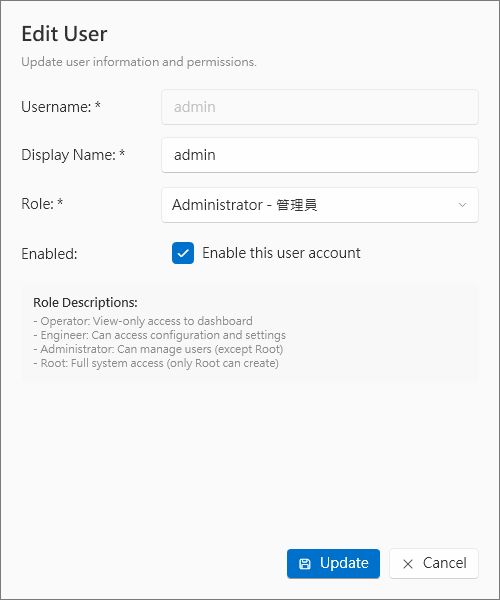
  - 說明：更新使用者名稱、調整權限設定、修改其他相關資訊
- 5
  - 操作：
  - 說明：完成修改動作


#### 修改使用者密碼

- 1
  - 操作：
  - 說明：進入使用者管理頁面
- 2
  - 操作：選取要修改密碼的使用者
  - 說明：從使用者列表中選擇目標使用者
- 3
  - 操作：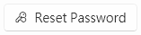
  - 說明：點擊修改使用者密碼按鈕
- 4
  - 操作：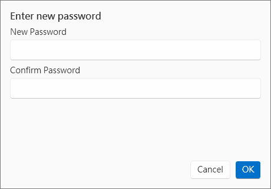
  - 說明：輸入新密碼、確認新密碼
- 5
  - 操作：
  - 說明：完成修改動作


#### 刷新使用者列表

- 1
  - 操作：
  - 說明：進入使用者管理頁面
- 2
  - 操作：點擊重新整理按鈕
  - 說明：更新列表資料，重新載入最新的使用者清單


#### 刪除使用者

- 1
  - 操作：
  - 說明：進入使用者管理頁面
- 2
  - 操作：
  - 說明：選取要刪除的使用者
- 3
  - 操作：確認選取正確的使用者
  - 說明：確保選擇了正確的使用者帳戶
- 4
  - 操作：
  - 說明：點擊刪除按鈕
- 5
  - 操作：在確認對話框中確認刪除動作
  - 說明：最終確認移除使用者帳戶


## 6. 疑難排解

### CFX 無法連線
- 檢查 `Endpoint URL`、帳密、網路、防火牆
- 使用 `Validate` 驗證設定
- 必要時使用 `Reset to Default` 重置

### 指示燈不更新
- 檢查 `Modbus IP/Port` 是否正確
- 確認通道設定從 1 起算
- 確認使用逗號分隔格式

### Cupola360 視角無法切換
- 確認 RTSP URL 正確
- 確認服務可用
- 使用測試按鈕驗證
- 必要時送出結束事件

### 設定未生效
- 確認是否已按下 `Save`
- 涉及 CFX 時需要 `Restart CFX`

## 7. 安全與權限

- 僅授權使用者可進行使用者管理與敏感設定
- 佇列、API 或通訊設定變更前，請先備份並通知相關人員

---

**文件版本**：1.0  
**最後更新**：2025年12月31日
